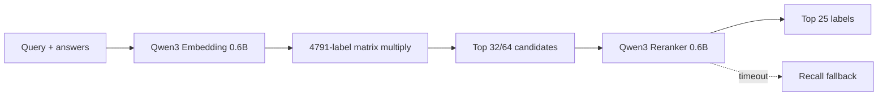
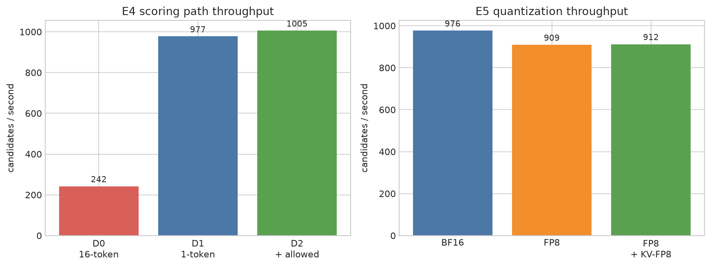

# Cascade Rank Serving

An online search-ranking service built from the Kaggle EEDI misconception-mining pipeline. It turns a query plus answer pair into a ranked list of intent labels, then measures the latency and GPU cost of each LLM stage.

## Architecture



The service keeps the 4,791-label pool in a GPU matrix and uses brute-force retrieval. The benchmark target is the LLM ranking layer, not ANN engineering.

## Results That Matter

| Finding | Measurement |
|---|---:|
| Document-at-end vs document-at-start | 1.45x candidates/s, 0.847 vs 0.407 cache hit |
| Controlled prefix-cache effect (A2 → A1) | 1.71x candidates/s, 0.000 → 0.847 cache hit |
| Full 16-token decode vs one-token scoring | 242 vs 977 candidates/s |
| `allowed_token_ids=[yes,no]` overhead | 1,005 vs 977 candidates/s |
| BF16 vs online FP8 | 976 vs 909 candidates/s |
| FP8 + KV-FP8 | MAP@25 0.398, E2E p99 57.3 ms |



The measured E1 gain is below the planned 2x gate, so prefix caching is reported as an optimization with a bounded benefit rather than presented as a fabricated win. BF16 remains the default; KV-FP8 is an explicit feature flag.

The delivery demo includes a timeout degradation path. On the dual-card host,
the service runs as a single-card instance; the timeout is an end-to-end
budget, and an expired rerank returns the already-computed `recall_top25`
without recomputing embeddings. Capacity planning is recorded in
[`results/d7_capacity_20260907-091600_01f0f564.json`](results/d7_capacity_20260907-091600_01f0f564.json)
and [`assets/capacity_pareto.png`](assets/capacity_pareto.png); it deliberately
reports only observed benchmark points and leaves the concurrency knee point
unset.

## Run The Service

```bash
conda activate py312
python -m src.serve.serve --port 8000
```

Enable KV-FP8 explicitly when testing the alternate memory profile:

```bash
python -m src.serve.serve --port 8000 --kv-cache-dtype fp8
```

The endpoint is `POST /v1/rank`:

```bash
curl -s http://127.0.0.1:8000/v1/rank \
  -H 'content-type: application/json' \
  -d '{"query":"What is 20% of 50?","correct_answer":"10","incorrect_answer":"20"}'
```

Each response includes top-25 labels, total/recall/rerank milliseconds, candidate count, and whether the timeout fallback returned recall results. The embedding stage uses Transformers; vLLM is used for the reranker.

Optional service pressure test:

```bash
python -m src.serve.bench_serve --url http://127.0.0.1:8000/v1/rank --requests 100 --concurrency 4

# Frozen-eval paired quality/degradation report
python -m src.serve.bench_serve \
  --url http://127.0.0.1:8000/v1/rank \
  --eval-jsonl data/eval_set_v1.jsonl \
  --timeout-ms 150 --baseline-timeout-ms 1000 \
  --output results/d7_service_smoke_YYYYMMDD-HHMMSS.json
```

## Reproduce Benchmarks

All benchmark commands use the frozen 200-query evaluation set and discard the first 20 queries as warmup.

```bash
./scripts/run_e4_scoring_paths.sh
./scripts/run_e5_quantization.sh
./scripts/run_capacity_plan.sh
```

## Environment

The experiments ran on 2 x RTX 5090 (`sm_120`, P2P disabled), CUDA 13, PyTorch 2.11.0+cu130, and vLLM 0.25.1. Tensor parallelism is intentionally avoided because the cards have no P2P path; BF16 is the one-command rollback baseline.

See [REPORT.md](REPORT.md) for the full experiment record, failure analysis, and delivery decisions.
